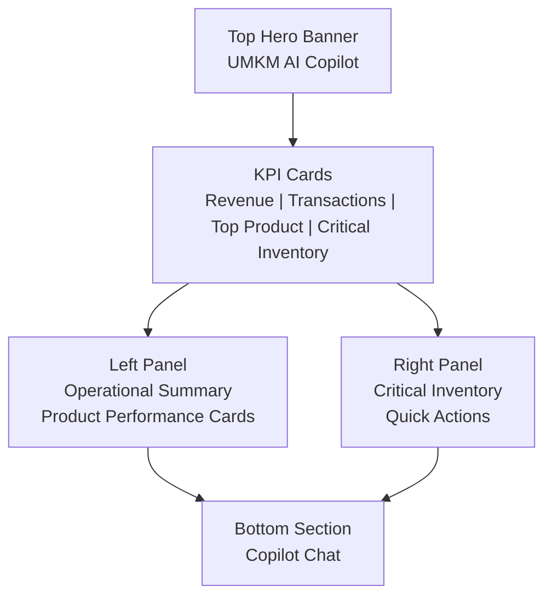
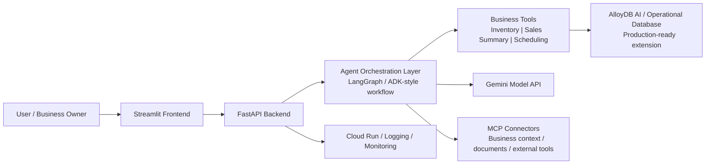

# UMKM AI Copilot

## 1. Problem Statement
Micro and small businesses often run daily operations with fragmented tools, manual stock checks, reactive purchasing, and little decision support. This leads to stockouts, missed sales opportunities, slow operational responses, and owners spending too much time on routine coordination instead of growth.

## 2. Brief About the Idea
UMKM AI Copilot is an AI-powered operations assistant designed for small businesses such as coffee shops, food stalls, and neighborhood retailers. Instead of acting as a generic chatbot, it works as an operational control layer that helps business owners monitor sales, detect critical inventory, prioritize restocking, and prepare operational actions from one place.

The solution combines a conversational copilot, structured business tools, and a dashboard-style interface. It allows users to ask questions in natural language, receive business-focused recommendations, and trigger workflow-oriented actions such as stock checks, daily summaries, and supplier scheduling. The goal is to make advanced operational intelligence accessible to small businesses without requiring them to adopt complex enterprise systems.

## 3. Solution Overview

### 3.1 How We Approached the Problem
We approached the problem by turning common SME pain points into concrete AI workflows: check stock, summarize operations, recommend restocking, analyze sales, and prepare follow-up actions. The solution uses an agent-style orchestration pattern so requests can be routed to the right business tool instead of relying on generic chat alone.

This design also aligns well with ADK, MCP, and AlloyDB AI. ADK-style orchestration supports multi-step actions, MCP enables structured access to external business context, and AlloyDB AI provides a natural path for live operational data and retrieval in a production version.

### 3.2 Real-World Problem and Practical Impact
The solution addresses a real daily challenge for SME owners: making fast operational decisions without an analyst, integrated dashboard, or large software budget. Problems such as stockouts, delayed supplier follow-up, and missed sales opportunities directly affect revenue.

UMKM AI Copilot helps by converting day-to-day business signals into clear recommendations and actions. The impact is faster restocking, fewer inventory risks, better sales visibility, and less manual coordination for the owner.

### 3.3 Core Approach and Workflow
The workflow is simple: the user asks a business question, the backend identifies the intent, the agent calls the right tool, and the system returns an action-oriented answer through the dashboard and chat. In a production-ready extension, MCP and AlloyDB AI would provide persistent context, business memory, and richer retrieval.

## 4. Opportunities

### 4.1 How It Differs from Existing Ideas
Many existing SME AI demos are either generic chatbots, dashboard-only analytics tools, or productivity assistants with weak business grounding. UMKM AI Copilot is different because it is designed around operational decision loops, not just information lookup or question answering.

It connects conversational AI with structured actions such as restocking, performance summarization, and meeting preparation. This makes the experience closer to an AI operations teammate than a standard business FAQ bot.

### 4.2 USP of the Proposed Solution
- Built specifically for daily SME operations, not generic chat use cases.
- Combines dashboard visibility with conversational action-taking.
- Designed for tool-based execution instead of text-only output.
- Ready to integrate with MCP for context portability and AlloyDB AI for real operational memory and retrieval.
- Deployable on Google Cloud with a clear path to production scaling.

## 5. List of Features
- AI copilot chat for natural-language business requests
- Daily operational dashboard with key metrics
- Critical inventory monitoring
- Restock recommendation generation
- Top-product and margin insight analysis
- Supplier follow-up and scheduling support
- Session-aware conversation flow
- Tool-based action orchestration
- Cloud-deployable backend and lightweight frontend
- Offline-safe local fallback mode for demo resilience

## 6. Process Flow Diagram
c

## 7. Wireframes / Mock Diagrams

## 8. Architecture Diagram

## 9. Technologies / Google Services Used

### 9.1 Technologies and Services
- Python
- FastAPI
- Streamlit
- LangGraph
- Gemini API
- Google Cloud Run
- Google Secret Manager
- Docker
- MCP-ready integration pattern
- AlloyDB AI-ready data architecture

### 9.2 Why This AI Stack and System Design
We chose a lightweight but production-oriented stack. FastAPI provides a clean service layer for deployment and future API expansion, while Streamlit enables a fast business-facing interface suitable for hackathon demos and rapid user validation. LangGraph was chosen because it supports tool-based orchestration and controlled agent workflows, which is much closer to a real operational copilot than plain prompt-response chat.

Gemini provides strong natural-language capability for reasoning over operational questions, while Google Cloud Run offers fast deployment, autoscaling, and low operational overhead. Secret Manager keeps API credentials out of code and supports safer deployments. The architecture is intentionally modular so that MCP can serve as the standardized context layer and AlloyDB AI can act as the operational memory and retrieval backend when moving from demo to production.

### 9.3 Scalability and Real-World Deployment
This design supports real-world scaling because each layer can evolve independently:
- The frontend can expand into a richer operations workspace without changing the backend contract.
- The backend API can expose more business workflows as services.
- The orchestration layer can manage more specialized agents and tool chains.
- AlloyDB AI can replace mock data with live transactional and semantic business context.
- Cloud Run can scale the backend based on traffic while remaining cost-efficient for SMEs.

This gives the project a realistic path from hackathon prototype to production-grade SME operations platform.
